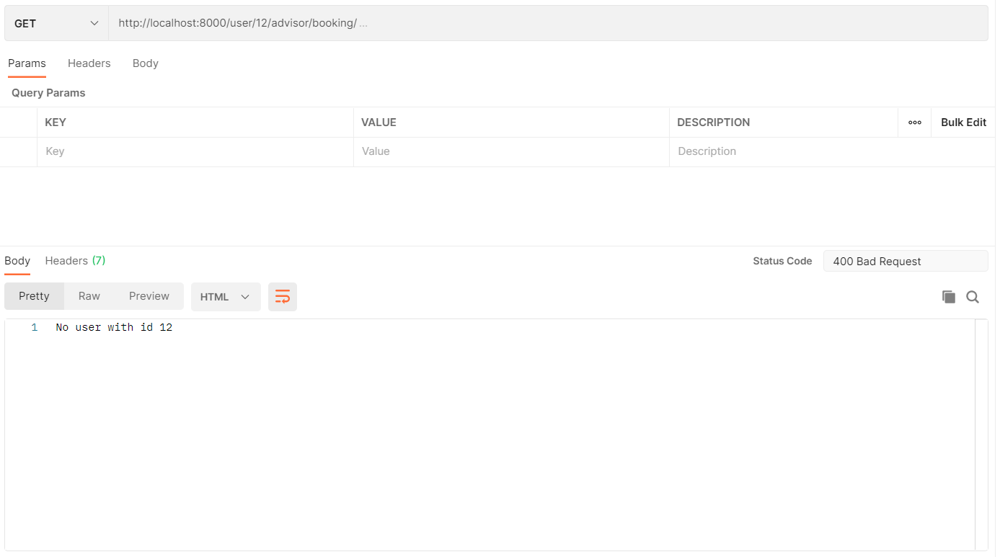

# NurtureLabs

#### Heroku Link : [NurtureLabs](https://nurture--labs.herokuapp.com/)

#### Postman Import : [Postman](https://github.com/danieldavidraj/NurtureLabs/blob/main/Django.postman_collection.json)

## Tools Used:
* Django
* Django REST framework
* Python
* JSON Web Tokens
* Postman

## Admin

### API: Add an advisor

## User

### API: Can register as a user

### API: Can log in as a user

### API: Get the list of advisors

### API: Can book call with an advisor

